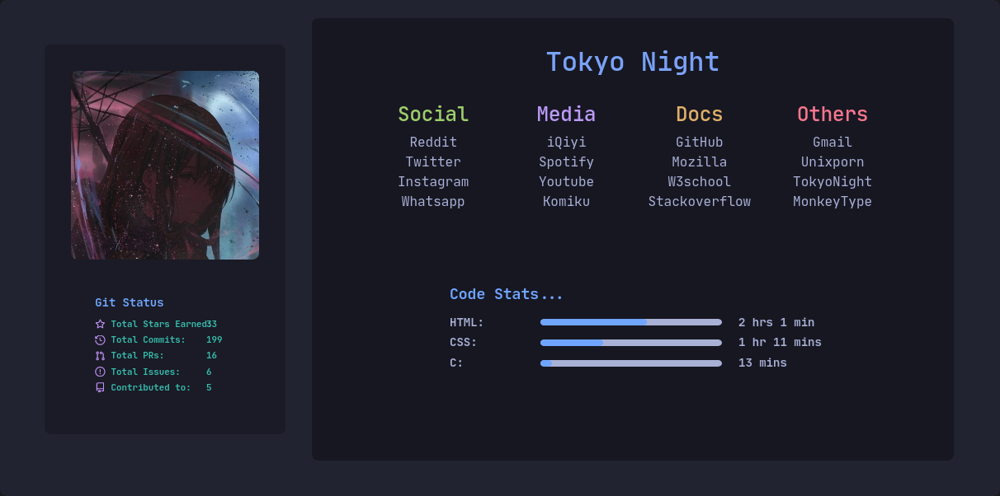

<h1 style="text-align:center" >🏠 Home</h1>

-- __A local home page for browsers with bootstrap__

#### Preview:

## 🔖 Ways to use:
* __Download this repo__
* __Change the git status settings for your wakatime and github user (line 67 and line 22)__
* __Save and set the file to default home page__

## 💻 Made with:

## 🔨 Maintenance

